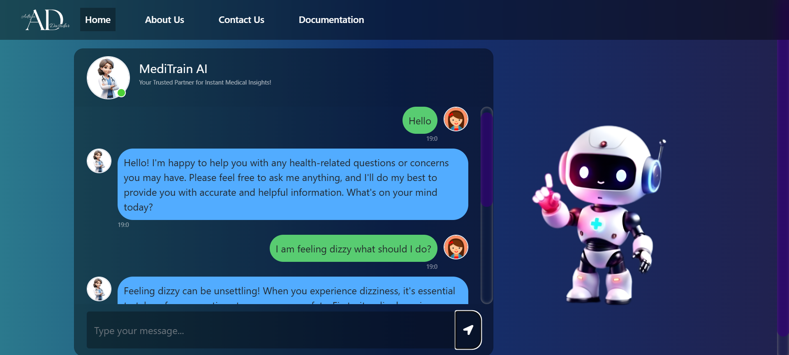

# 🩺 MediTrain AI: Personal Medical Assistant

Welcome to **MediTrain AI** 💡, an AI-powered medical assistant designed to provide accurate and concise information about medical topics. Built with state-of-the-art technologies like Pinecone for vector search and Groq for high-performance inference, this project is your personal medical encyclopedia, powered by machine learning models.

 Live Link - https://meditrain-0r3t.onrender.com

---

## 📖 Table of Contents

- [Overview](#overview)
- [Features](#features)
- [Technologies Used](#technologies-used)
- [How to Use](#how-to-use)
- [Contributing](#contributing)

---

## 🏥 Overview

**MediTrain AI** is a cutting-edge medical chatbot 🤖 that uses AI to answer health-related queries. This project is based on various libraries and frameworks like `Langchain`, `Pinecone`, and `Groq`, which allow efficient information retrieval, question-answering, and text embedding. It processes large PDF medical documents 📑 and uses embeddings to provide relevant answers to medical questions.

### ✨ Key Features:
- **📄 Medical Document Loader**: Loads and processes medical PDFs.
- **📚 Text Splitter**: Breaks down large documents into smaller, manageable chunks.
- **🤖 Embedding**: Uses Hugging Face embeddings for document representation.
- **🔎 Pinecone Vector Search**: Enables fast search for similar documents.
- **💬 GroqAI Integration**: A high-performance LLM (Language Model) to generate answers based on retrieved information.
- **🩺 Medical Question-Answering**: Provides detailed answers to medical questions based on documents and retrieved context.

---
## 📸 Screenshots

Here are some screenshots of **MediTrain AI** in action:

### 1. Chat Interface

### 2. About Section

### 3. Contact Us


---
## 💡 Features

✨ **Accurate Answers**: Ask medical questions and receive precise, clear, and medically relevant answers.

📄 **Document Handling**: Automatically loads medical documents, splits them into smaller chunks, and uses embeddings to understand the context.

🔎 **Smart Search**: Uses Pinecone to search for the most relevant information quickly and accurately.

🤖 **Advanced Language Models**: Chat with an AI trained to provide information in a professional tone, with detailed explanations and suggestions.

---

## 🛠 Technologies Used

- **[Langchain](https://www.langchain.com/)**: A framework for building applications with LLMs and document processing.
- **[Pinecone](https://www.pinecone.io/)**: A vector database for fast similarity search.
- **[Groq](https://www.groq.com/)**: A high-performance LLM to generate responses.
- **[Hugging Face](https://huggingface.co/)**: Provides pre-trained models for text embedding.
- **[Flask](https://flask.palletsprojects.com/)**: Python web framework for creating APIs.
- **[Dotenv](https://pypi.org/project/python-dotenv/)**: For managing environment variables securely.

---

## 🛠 How to Use

1. **Clone this repository**:
   ```bash
   git clone https://github.com/yourusername/mediTrain-AI.git
   cd mediTrain-AI
   ```

2. **Install dependencies**:
   Use the following command to install the required Python packages:
   ```bash
   pip install -r requirements.txt
   ```

3. **Set up environment variables**:
   Create a `.env` file in the root directory and add the following keys:
   ```bash
   PINECONE_API_KEY=your_pinecone_api_key
   GROQ_API_KEY=your_groq_api_key
   ```

4. **Run the project**:
   You can now run the Python script to start interacting with the medical assistant.
   ```bash
   python app.py
   ```

5. **Querying the AI**:
   Once the system is set up, you can query the AI with medical questions 🩺 and receive informative responses.

---

## 🤝 Contributing

We welcome contributions! If you would like to contribute to the project, please follow the steps below:

1. **Fork the Repository**: Fork this repository to your own GitHub account.
2. **Clone the Forked Repository**:
   ```bash
   git clone https://github.com/yourusername/mediTrain-AI.git
   ```
3. **Create a Feature Branch**:
   ```bash
   git checkout -b feature/your-feature
   ```
4. **Commit Your Changes**:
   ```bash
   git commit -am 'Added new feature'
   ```
5. **Push the Changes**:
   ```bash
   git push origin feature/your-feature
   ```
6. **Create a Pull Request**: Open a pull request from your branch to the main repository.

---

## 📧 Contact
For any questions or suggestions, feel free to reach out:
- **Adrija Dastidar** - adrijadastidar@example.com
- **GitHub**: [AdrijaDastidar](https://github.com/AdrijaDastidar)


---

🌟 **MediTrain AI** is here to make medical information more accessible and easier to understand. Ask your health questions now! 🩺
